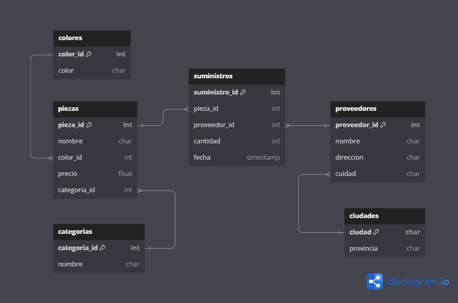

# Práctica Grupal: Diseño de Base de Datos

Para esta práctica se pide diseñar el modelo de datos con las tablas SQL, sus campos y tipos así como las relaciones de una base datos cuyas características se detallan a continuación.

## Integrantes

- Juamna
- Victor
- Carlos
- Luis
- Lander

## Especificaciones

Tenemos que diseñar una base de datos sobre proveedores y disponemos de la siguiente
información.

De cada proveedor conocemos:  
- Nombre  
- Dirección  
- Ciudad  
- Provincia  
- Código de proveedor (único para cada uno de ellos)  
  
Queremos llevar un control de las piezas que nos suministra cada proveedor. Es importante conocer la cantidad de las diferentes piezas que nos suministra y en qué fecha lo hace. Un mismo proveedor nos puede suministrar una pieza con el mismo código en diferentes fechas.  

El diseño de la base de datos debe permitir almacenar un histórico con todas las fechas y las cantidades que nos ha proporcionado un proveedor. Una misma pieza puede ser suministrada por diferentes proveedores.  

De cada pieza conocemos:
- Código de pieza(único)
- Nombre
- Color
- Precio
- Categoría.  

Pueden existir varias categorías y cada categoría tiene:
- Nombre
- Código de categoría único
Una pieza sólo puede pertenecer a una categoría.

## Modelo BD

